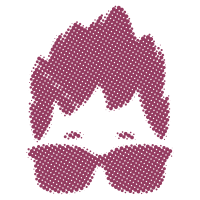

<h1 align="center">
  
   
  PTR Projects
   
</h1>

<h4 align="center">Summer Camp for Computer Science.</h4>

## About

This repository is a collection of all the educational projects that were developed by attendees of our Summer Camp for Computer Science (Poletni tabor računalništva). For more than a decade, a team of seasoned coder monkeys has been evangelizing beauties of programming to youngsters from the whole country.

## What about previous years?

Don't worry! All your projects are still here! We use branches to snapshot all the work before we replace the content of our `main` branch.

## License

All code in this repository is published and distributed under `GPLv3`. See `LICENSE` for more information.

## Organizers

  
  

